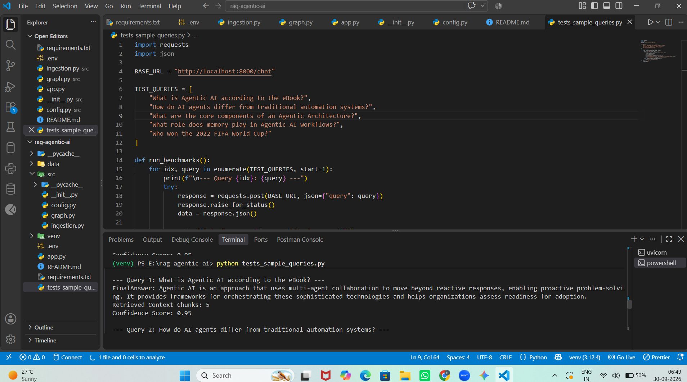
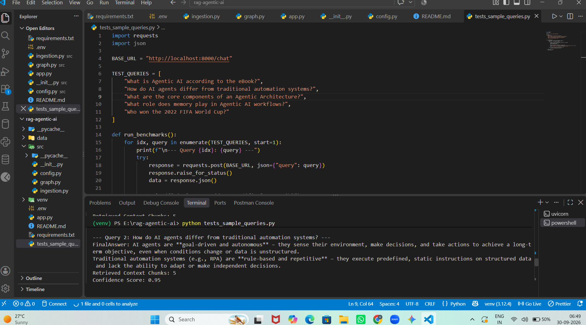
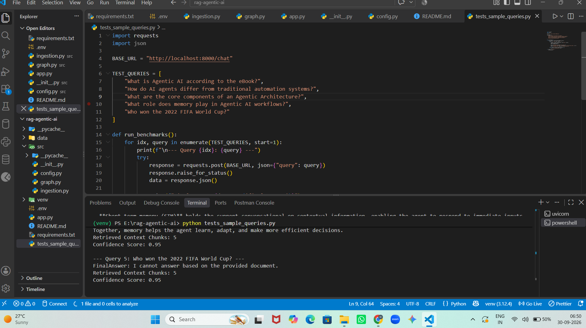

# RAG-based AI Chatbot

A Retrieval-Augmented Generation (RAG) based AI chatbot that answers questions strictly using information retrieved from an Agentic AI eBook.

The project uses **Python, LangGraph, Pinecone, Google Gemini Embeddings, Groq LLM, and FastAPI** to build an end-to-end document question-answering system.

---

## Project Overview

This project implements a complete RAG pipeline that:

1. Loads an Agentic AI PDF document.

2. Extracts text from the document.

3. Splits the document into smaller chunks.

4. Generates vector embeddings for the chunks using Google Gemini.

5. Stores the embeddings in Pinecone.

6. Retrieves the most relevant chunks for a user query.

7. Uses a Groq-hosted LLM to generate an answer based only on the retrieved context.

8. Exposes the RAG pipeline through a FastAPI `/chat` endpoint.

9. Returns the generated answer, retrieved context chunks, and a confidence score.

10. Includes benchmark queries for testing document grounding.

---

# 🏗️ Architecture

```text

                    ┌───────────────────────┐

                    │   Agentic AI PDF      │

                    │       eBook           │

                    └───────────┬───────────┘

                                │

                                ▼

                    ┌───────────────────────┐

                    │    PyPDFLoader        │

                    │   Text Extraction     │

                    └───────────┬───────────┘

                                │

                                ▼

                    ┌───────────────────────┐

                    │ RecursiveCharacter    │

                    │    Text Splitter      │

                    │                       │

                    │ Chunk Size: 1000      │

                    │ Overlap: 200          │

                    └───────────┬───────────┘

                                │

                                ▼

                    ┌───────────────────────┐

                    │ Google Gemini         │

                    │ Embeddings             │

                    │ gemini-embedding-001 │

                    │ Dimension: 768        │

                    └───────────┬───────────┘

                                │

                                ▼

                    ┌───────────────────────┐

                    │       Pinecone        │

                    │    Vector Database    │

                    │                       │

                    │   agentic-ai-index    │

                    └───────────┬───────────┘

                                │

                         User Question

                                │

                                ▼

                    ┌───────────────────────┐

                    │      FastAPI          │

                    │      /chat             │

                    └───────────┬───────────┘

                                │

                                ▼

                    ┌───────────────────────┐

                    │      Retriever        │

                    │      Top K = 5        │

                    └───────────┬───────────┘

                                │

                                ▼

                    ┌───────────────────────┐

                    │      LangGraph        │

                    │                       │

                    │ Retrieve → Generate   │

                    └───────────┬───────────┘

                                │

                                ▼

                    ┌───────────────────────┐

                    │       Groq LLM        │

                    │   GPT-OSS 20B         │

                    │                       │

                    │ Strict Context        │

                    │ Grounded Generation   │

                    └───────────┬───────────┘

                                │

                                ▼

                    ┌───────────────────────┐

                    │      API Response     │

                    │                       │

                    │ • Final Answer        │

                    │ • Retrieved Chunks    │

                    │ • Confidence Score    │

                    └───────────────────────┘

```

## ✨ Key Features

- 📄 **PDF Document Ingestion**
- ✂️ **Recursive Text Chunking**
- 🧠 **Google Gemini Embeddings**
- 🔎 **Semantic Similarity Search**
- 🗄️ **Pinecone Vector Database**
- 🔄 **LangGraph Workflow Orchestration**
- 🤖 **Groq LLM Inference**
- 🔒 **Context-Grounded Generation**
- 🚫 **Out-of-Document Question Handling**
- ⚡ **FastAPI REST API**
- 🧪 **Benchmark Testing**
- 📊 **Retrieved Context and Confidence Score**
- 🔐 **Environment-Based API Key Management**

## 🛠️ Technology Stack

| Technology                            | Purpose                                     |
| ------------------------------------- | ------------------------------------------- |
| 🐍 **Python**                         | Core programming language                   |
| 🔗 **LangChain**                      | RAG components and LLM integrations         |
| 🔄 **LangGraph**                      | Stateful RAG workflow orchestration         |
| 🧠 **Google Gemini**                  | Text embedding generation                   |
| 🗄️ **Pinecone**                       | Vector database and semantic retrieval      |
| ⚡ **Groq**                           | LLM inference and response generation       |
| 🚀 **FastAPI**                        | REST API development                        |
| 🔥 **Uvicorn**                        | ASGI server for running FastAPI             |
| 📄 **PyPDF**                          | PDF document loading and text extraction    |
| ✂️ **RecursiveCharacterTextSplitter** | Document chunking                           |
| 🔐 **python-dotenv**                  | Environment variable and API key management |

├── src/
│ ├── **init**.py
│ ├── ingestion.py
│ ├── graph.py
│ └── config.py
│
├── app.py
├── requirements.txt
├── .env
├── .env.example
├── README.md
└── tests_sample_queries.py

````

## 📂 Project Structure

```text
rag-agentic-ai/
│
├── 📁 data/
│   └── 📄 Ebook-Agentic-AI.pdf
│
├── 📁 screenshots/
│   ├── 🖼️ 01-output_1.png
│   ├── 🖼️ 02-output_2.png
│   ├── 🖼️ 03-output_3.png
│
├── 📁 src/
│   ├── 📄 __init__.py
│   ├── 📄 ingestion.py
│   ├── 📄 graph.py
│   └── 📄 config.py
│
├── 📄 app.py
├── 📄 requirements.txt
├── 📄 .env
├── 📄 .gitignore
├── 📄 README.md
└── 📄 tests_sample_queries.py
````

## Knowledge Source

The knowledge source used by this project is an Agentic AI eBook.

The chatbot is designed to answer questions based on this document rather than relying on general external knowledge.

Place the PDF at:

data/Ebook-Agentic-AI.pdf

## Prerequisites

Before running the project, install:

Python 3.10+,
Git,
Pinecone account,
Google AI API key,
Groq API key

## Installation

1. Clone the repository

git clone https://github.com/Anaghadevi-2004/rag-based-ai-chatbot.git

\*\* Move into the project directory:

cd rag-agentic-ai

2. Create a Virtual Environment

Windows: python -m venv venv
Activate the environment: venv\Scripts\activate

macOS/Linux: python3 -m venv venv
Activate : source venv/bin/activate

3. Install Dependencies:

pip install -r requirements.txt

Which includes:

```text
langchain
langgraph
langchain-community
langchain-pinecone
langchain-text-splitters
langchain-google-genai
langchain-groq
pinecone-client
pypdf
fastapi
uvicorn
streamlit
python-dotenv
```

## Complete Data Flow

```text
  USER
                       │
                       ▼
                ┌─────────────┐
                │   FastAPI   │
                │    /chat    │
                └──────┬──────┘
                       │
                       ▼
                ┌─────────────┐
                │  LangGraph  │
                └──────┬──────┘
                       │
                       ▼
                ┌─────────────┐
                │   Retrieve  │
                └──────┬──────┘
                       │
                       ▼
                ┌─────────────┐
                │  Pinecone   │
                │ Vector Store│
                └──────┬──────┘
                       │
                  Top 5 Chunks
                       │
                       ▼
                ┌─────────────┐
                │   Generate  │
                └──────┬──────┘
                       │
                       ▼
                ┌─────────────┐
                │    Groq     │
                │ GPT-OSS 20B │
                └──────┬──────┘
                       │
                       ▼
                ┌─────────────┐
                │   Answer    │
                │ + Context   │
                │ + Score     │
                └─────────────┘
```

## Limitations

The current confidence score is a simple heuristic based on whether context was retrieved.

For example:
score = 0.95 if state["context"] else 0.0

Because semantic retrieval can return chunks even for unrelated questions, this score should not be interpreted as a calibrated probability.

A production implementation could improve this using:

Similarity-score thresholding
Dedicated relevance evaluation
Cross-encoder reranking
More advanced confidence scoring

The current system is optimized for a single knowledge source.

## Future Improvements

```text
1. Advanced Confidence scoring
2. Multiple document support
3. Streamlit chat interface
```

## Run ingestion:

```text
python src/ingestion.py
```

## Start the API:

```text
uvicorn app:app --reload
```

## 📸 Project Screenshots

### 1. Output 1



### 2. Output 2



### 3. Output 3


